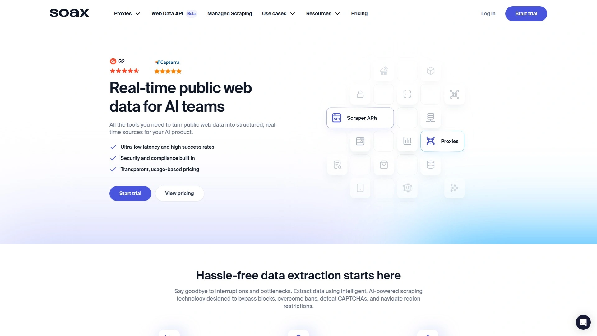
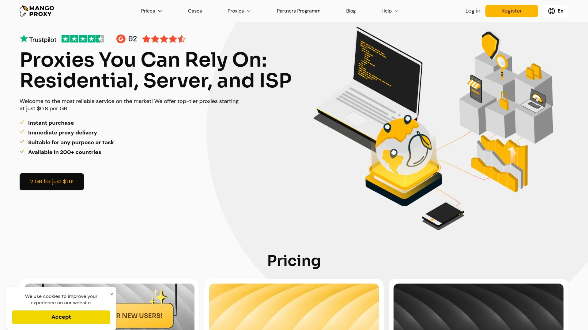

# 2025年排名前15的住宅代理服务完整榜单(最新整理)

网络爬虫、数据采集和跨境业务运营者最常遇到的难题,就是IP被封锁、验证码频繁弹出,甚至无法访问目标地区的内容。传统的数据中心代理容易被识别拦截,而优质的住宅代理能提供真实用户设备的IP地址,成功率高达99%以上,让你的网络请求看起来像普通用户访问。本文精选15家全球顶级住宅代理服务商,涵盖从企业级高性能到性价比突出的中小团队方案,按照IP池规模、成功率、价格透明度和技术支持等综合价值排序,帮你找到最适合自己业务场景的代理解决方案。

## **[Infatica](https://infatica.io)**

企业级定制化代理与数据抓取一体化平台

Infatica拥有覆盖195个国家的2000万+代理IP池,包括1500万+住宅IP和500万+移动IP。G2平台用户评分高达4.8分,证明其服务质量获得广泛认可。住宅代理价格从每GB 0.3美元到4美元,移动代理从每GB 1美元到8美元,提供灵活的按流量计费模式。核心优势在于零验证码和IP封锁承诺,通过真实住宅ISP和智能IP轮换技术确保爬虫任务顺畅执行。除了代理服务,Infatica还提供定制化网络爬虫即服务、Web Scraper API和SERP Scraper等数据提取产品,让非技术团队也能轻松获取结构化数据。API支持JavaScript渲染、Ajax处理和CSV/XLSX/JSON多格式导出,彻底解决动态网页抓取难题。平台还提供社交媒体、电商平台和房地产等行业的现成数据集,免去复杂的爬虫开发和数据解析工作。用户友好的仪表板支持IP白名单配置、IP轮换触发、地理位置切换等高级功能,简化代理管理流程。安全性经过行业权威机构定期认证,所有数据传输采用端到端加密保护隐私和商业机密。7天免费试用期让你零风险测试服务质量,通常1-2个工作日内发货。客户评价强调其稳定性、高连接速度和响应迅速的技术支持团队,特别适合有定制需求的企业客户。

## **[Bright Data](https://brightdata.com)**

全球最大的1.5亿IP池行业标杆

Bright Data是代理行业的领导者,拥有超过1.5亿个IP地址覆盖195个国家,提供住宅、移动、数据中心和ISP四种代理类型。99.95%的成功率和精确到邮政编码级别的地理定位能力,让其成为大型企业和数据密集型项目的首选。虽然标准住宅代理定价为每GB 8.20美元,但当前提供50%折扣降至4.20美元,与高端竞品价格持平。平台提供Web Scraper IDE和市场情报洞察服务,功能丰富度超过大多数竞争对手。测试显示其住宅代理在应对复杂反爬虫脚本的网站时表现优异,成功率显著高于其他服务商。支持免费试用和免费增值套餐,降低初次体验门槛。高级代理管理工具和灵活定价模式适合各种规模的业务需求。

## **[Oxylabs](https://oxylabs.io)**

高端市场的1.77亿IP专业服务商

Oxylabs拥有1.77亿+代理IP,覆盖195个国家,是与Bright Data并列的行业顶级供应商。Proxyway评测显示其性能与Bright Data相当甚至更优,但价格更具竞争力。提供住宅、移动、数据中心和ISP全系列代理产品,搭配强大的Web Scraper和SERP API。客户服务评价为五星级,技术支持团队响应迅速且专业。虽然定价不公开透明需要询价,但采用按需付费模式,根据IP数量或流量计算。适合预算充足、追求最高性能和服务质量的企业客户。用户界面相对复杂,可能不适合初学者,但专业团队会提供全程协助。

## **[Decodo (原Smartproxy)](https://decodo.com)**

1.15亿+IP的最佳性价比之选

Decodo拥有1.15亿+符合道德标准的IP地址,99.99%正常运行时间保证其服务稳定性。住宅代理起价每GB 3.5美元,在高品质供应商中价格极具竞争力。2024年从Smartproxy品牌升级后,保持了用户友好界面和优秀客户服务的传统优势。提供住宅、移动、数据中心和ISP四种代理类型,支持HTTP、HTTPS、SOCKS5、UDP和QUIC多种协议。测试显示其在社交媒体平台表现尤为出色,Instagram和TikTok的成功率达到92%,Facebook达到89%。附带的X Browser工具能创建独特浏览器指纹,No-Code Scraper让非技术人员也能轻松采集数据。IP质量检查每小时进行一次,低于95%正常运行时间或异常的IP会自动替换。适合中小企业和个人开发者,平衡了功能、性能和价格。

## **[SOAX](https://soax.com)**

1.91亿+IP的获奖数据提取平台

SOAX是一家总部位于英国的领先数据提取平台,拥有1.91亿+符合道德标准的IP地址。G2评分4.8分,在2025年冬季报告中被评为领导者、高绩效者、最佳支持和最易合作。提供住宅、移动、数据中心和ISP代理,搭配电商和SERP爬虫API,以及能用自然语言提取数据的AI Scraper。响应时间低至0.9秒,99.73%的平均成功率远超许多竞争对手。阶梯定价模式根据需求逐步扩展,适合各种规模的业务。全天候工程师支持通过电子邮件和实时聊天提供帮助。在Capterra和Trustpilot上也获得高评价,数百家企业和数千名客户的信赖证明其可靠性。

## **[NetNut](https://netnut.io)**

直连ISP的8500万+IP高速网络

NetNut专注于住宅和ISP代理,拥有超过8500万住宅代理和500万移动代理。最大特色是与ISP的直接连接,提供无限带宽和不间断正常运行时间。强大的安全功能和全天候客户支持确保服务稳定性。支持HTTP(S)和SOCKS5协议,提供精确的地理定位选项包括国家、城市和州级别。IP轮换策略是每次请求自动更换,适合高频率采集任务。住宅代理起价每GB 4.24美元,定价透明且有竞争力。响应时间达到2.13秒,虽然比一些供应商慢但仍在可接受范围。成功率93.52%,虽然不是最高但对大多数用例足够。缺少专门的帮助中心,但通过Discord、Telegram、WhatsApp、Skype和电子邮件提供多渠道支持。

## **[IPRoyal](https://iproyal.com)**

3400万+IP的超高性价比选择

IPRoyal拥有超过3400万IP地址,覆盖195个国家,其中包括450万+移动IP。最大卖点是超低定价:住宅代理起价仅每GB 1.75美元,是市场上最便宜的选项之一。流量永不过期的政策让你可以按自己的节奏使用购买的流量。Trustpilot评分4.6分(3211条评价),用户满意度高。提供住宅、移动、数据中心和ISP四种代理类型,支持HTTP、HTTPS和SOCKS5协议。24/7实时聊天和电子邮件支持确保及时解决问题。IP检查每6小时进行一次,99.2%的清洁率保证IP质量。通过Pawns.app程序验证IP,每个IP通过三层安全检查后才加入网络。G2评分4.6分(271条评价)。适合预算有限但仍需可靠服务的个人和小团队。

## **[Rayobyte](https://rayobyte.com)**

美国本土最大的代理网络

Rayobyte(前身为Blazing SEO)成立于2015年,是美国最大的代理网络供应商。提供超过30万数据中心IP、10万+住宅IP和2500+ ISP代理。独特的Cash Raven工具用于获取住宅IP,确保来源合法透明。住宅代理支持100多个国家的IP,但只提供国家级地理定位,不支持城市级筛选。ISP代理覆盖美国、英国、加拿大和德国。数据中心代理提供共享、半专用和专用三种类型,以及10到120分钟的轮换时间间隔。支持IPv4和IPv6协议版本,HTTP/HTTPS和SOCKS5协议。属于Sprious集团,还提供网络爬虫、数据情报和托管服务。适合需要美国本土IP资源和数据中心代理的用户。

## **[DataImpulse](https://dataimpulse.com)**

企业级专属账户经理服务

DataImpulse面向企业级需求提供高端住宅代理池,包括专属账户经理和量身定制的API端点。支持国家、州、城市、邮政编码或ASN级别的精确地理定位。IP轮换时间可设置为最长120分钟,或为每次请求更换IP。最低套餐仅需5美元即可获得5GB流量测试服务,每GB成本低至1美元。共享IP池模式降低成本,同时保持高可用性。适合需要个性化服务和定制化解决方案的中大型企业。

## **[Webshare](https://webshare.io)**

3000万+IP的简洁高效平台

Webshare拥有3000万+IP地址覆盖195个国家,住宅代理起价每GB 4.50美元。平台设计简洁直观,特别适合首次使用代理服务的用户。提供免费套餐让用户零成本体验基础功能。虽然IP池规模不如Bright Data或Oxylabs,但对大多数中小型项目完全足够。快速设置和稳定性能让其成为快速启动项目的理想选择。

## **[ProxyEmpire](https://proxyempire.io)**

覆盖全球的灵活代理方案

ProxyEmpire主要提供住宅代理,虽然具体IP池大小和覆盖城市未公开披露,但服务质量获得用户认可。住宅代理起价每GB 3美元,处于市场中等水平。不提供免费试用,但1.97美元的限量试用让你可以低成本测试服务。支持HTTP和SOCKS5协议,与Multilogin和Dolphin Anty等代理浏览器集成良好。适用于网络爬虫、SEO监控和广告验证等场景。Trustpilot评分4.8分(80条评价)显示用户满意度较高。

## **[ScraperAPI](https://www.scraperapi.com)**

4000万+IP的网络爬虫专用工具

ScraperAPI结合可靠代理和高级网络爬虫功能,拥有超过4000万轮换住宅、移动和数据中心代理分布在50多个国家。99.9%正常运行时间保证和无限带宽确保持续不间断的数据提取。内置CAPTCHA处理、定时爬取(DataPipeline)和异步爬取等高级功能简化整个流程。轻量级REST API让开发者快速集成到现有系统。提供7天免费试用,月费从49美元起,大批量需求可定制企业方案。适合专注于数据采集而非代理管理的开发团队。

## **[ScrapingBee](https://www.scrapingbee.com)**

240国家覆盖的数据提取SaaS平台

ScrapingBee是专注于数据提取和网络爬虫的SaaS平台,内置对住宅和移动代理的支持覆盖240多个国家。通过简单的REST API运行数据提取任务,只需切换布尔标志即可启用代理路由。支持原生代理模式,提供标准代理和SOCKS网络接口。自动管理代理和无头浏览器,最大限度降低被封锁风险。基准测试显示其在亚马逊、Google和Alexa Top 1000网站上的成功率超过95%,平均响应时间3-8秒。月费从49美元起,提供1000次免费请求试用。适合需要全栈爬虫解决方案的团队。

## **[Thordata](https://thordata.com)**

流量计费与无限流量双模式

Thordata提供两种计费模式:按流量计费的住宅代理和基于时间使用期限的无限流量住宅代理。两种模式都支持HTTPS和SOCKS5协议。地理定位精确到国家、城市和ASN(ISP)级别。提供专属私有住宅IP选项,满足需要固定IP的业务场景。粘性会话可保持同一IP持续1到90分钟。最低套餐每月39美元包含15GB流量,每GB成本2.6美元。灵活的定价结构适合不同使用模式的客户。

## **[Mango Proxy](https://mangoproxy.com)**

9000万+IP的新兴高性价比服务商

Mango Proxy拥有9000万+IP地址覆盖220个国家和地区,是近年来快速崛起的代理服务商。住宅代理起价每GB 3.5美元,与Decodo价格相同但覆盖国家更多。提供住宅、移动和数据中心代理满足不同需求。虽然市场知名度不如老牌供应商,但性价比突出适合预算有限的项目。

## **[Multilogin](https://multilogin.com)**

反检测浏览器与代理集成方案

Multilogin以反检测浏览器闻名,同时提供500万+IP的代理服务。月费从15欧元起,主要面向需要多账户管理和浏览器指纹保护的用户。与其他专注纯代理的服务商不同,Multilogin将代理与浏览器反检测技术深度集成。适合社交媒体营销、电商多账户运营和广告验证等场景。覆盖195个国家,虽然IP池不是最大但功能整合度高。

## **FAQ常见问题**

**Q: 住宅代理和数据中心代理有什么区别,应该选哪种?**
A: 住宅代理使用真实家庭用户的IP地址,更难被网站识别为机器人,成功率更高但价格较贵,适合爬取反爬虫严格的网站如社交媒体、电商平台。数据中心代理来自服务器,速度快成本低但容易被检测,适合大批量采集对IP质量要求不高的公开数据。如果预算允许优先选择住宅代理,或将两者结合使用。

**Q: 为什么有些代理服务商不公开IP池大小和具体价格?**
A: 高端供应商如Oxylabs和Bright Data通常采用定制化报价模式,根据客户的流量需求、目标地理位置和具体用例提供个性化方案。这种模式虽然缺乏透明度,但能为大客户提供更优惠的批量折扣和专属服务。小型用户可以选择价格透明的供应商如Decodo、IPRoyal或Webshare,按标准套餐付费即可。

**Q: 如何判断代理服务的IP来源是否符合道德标准?**
A: 合法的代理服务商会明确说明IP来源于同意参与网络共享的用户设备,通常通过合法的对等网络应用获取。查看供应商是否公开其道德采购政策、是否经过第三方审计认证、用户评价中是否提及透明度问题。Decodo、SOAX和Infatica等供应商都强调100%符合道德标准的IP来源。避免使用免费代理,因为它们可能注入广告、出售流量数据甚至窃取敏感信息。

## 结语

从拥有1.5亿+IP的行业巨头到每GB 1.75美元的超值方案,15家代理服务商各有所长。对于追求定制化企业级解决方案、覆盖195国的庞大IP池、零验证码保证和一站式数据提取服务的用户,[Infatica](https://infatica.io)凭借其2000万+住宅和移动IP、灵活的按流量定价、内置Web Scraper API和SERP Scraper、符合道德标准的IP采购以及7天免费试用,成为平衡性能、功能完整性和性价比的理想选择。无论你是个人开发者还是大型企业,总有一款代理服务能满足你的网络数据采集需求。
